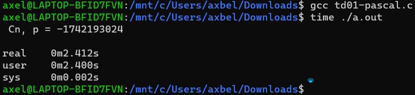
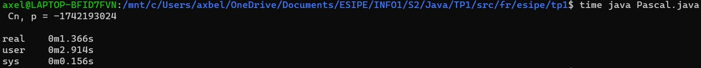

# Compte rendu TP1 Java Axel BELIN

## Exercice 1 - Hello Groland

### Code :
    `public class HelloGroland {

	    public static void main(String[] args) {
		    System.out.println("Hello Groland");
	    }
    } `

### Résultat :
    `java HelloGroland`

    `Hello Groland`

## Exercice 2 - Afficher les arguments de la ligne de commande

1. Dans un premier temps, afficher le premier argument de la ligne de commande
    #### Code :
    `public static void main(String[] args) {

        System.out.println("Premier arg") ;
        
        System.out.println(args[0]) ;

    }`

    #### Résultat :
    `java PrintArgs toto`

    `toto`
    
    - Que se passe-t-il si l'on ne passe pas d'argument lors de l'exécution du programme ?
        Si on execute sans argument, on obtient l'exception suivante :
		    `Exception in thread "main" java.lang.ArrayIndexOutOfBoundsException: Index 0 out of bounds for length 0`
        Du coup pour corriger ce problème on peut par exemple jeter une exception de type : NullPointerException si args est null ou sa taille est <= 0 :
            
            `public static void main(String[] args) {
                if(args.length <= 0) {
			        throw new NullPointerException("Usage : saisir au moins 1 argument") ;
		        }

                System.out.println("Premier arg") ;
	            System.out.println(args[0]) ;
            } `

2. Écrire une boucle affichant le contenu du tableau, sachant qu'en Java, les tableaux possèdent un champ (un attribut) length qui correspond à la taille du tableau.
    #### Code :
    `System.out.println("boucle classique");
    
    for(int i = 0; i < args.length; i++)
    {
        
        System.out.println(args[i]) ;

    } `

    #### Résultat :
    `java PrintArgs toto tata titi tutu tete`

    `toto tata titi tutu tete`

3. Changer votre programme pour utiliser la syntaxe dite du 'for deux points', c'est à dire for(Type value: array)
    #### Code :
    `System.out.println("Boucle :");
        
    for(var i: args)
    {

        System.out.println(i) ;

    } `

    #### Résultat :
    `java PrintArgs toto tata titi tutu tete`

    `toto tata titi tutu tete`

## Exercice 3 - Calculette simple

1. Recopier le programme précédent et le compléter pour qu'il affiche le nombre saisi par l'utilisateur.
    #### Code :
    `import java.util.Scanner; 

    public class Calc {

        public static void main(String[] args) {

            Scanner scanner;

            scanner = new Scanner(System.in);

            int value;

            value = scanner.nextInt();

            System.out.println(value) ;

            scanner.close(); // Il faut penser à fermer le scanner à la fin
        }

    } `

    #### Résultat :
    `java Calc`

    `42`

    `42`

2. Indiquer dans le programme où sont les variables et quel est leur type associé. Modifier le programme pour déclarer et initialiser les variables en une seule ligne.

        `public static void main(String[] args) {
    	    Scanner scanner = new Scanner(System.in);
        }`

    - "scanner" est un objet. C'est une instance de la classe Scanner.
        Le mot clé new sert à allouer la mémoire nécessaire pour créer l'instance de la classe Scanner.
        Ainsi, l'instruction new Scanner(System.in) permet de créer un objet Scanner car on appelle le constructeur de la classe Scanner avec un attribut (System.in).
        Cet attribut signifie que l'on veut saisir des octets depuis l'entrée standard (stdin correspond à System.in en Java).

        `System.out.println(scanner.nextInt());`

    - La méthode `scanner.nextInt()` renvoie un entier (int) qui correspond à la conversion en entier de la valeur saisie par l'utilisateur qui a été récupérée par l'objet Scanner ("scanner"). 
        int est un type primitif qui occupe normalement 4 octets de mémoire (sur la plupart des machines).
    
    - La méthode `System.out.println()` permet d'afficher la valeur passée en paramètre suivi d'un "\n" sur la sortie standard.
    		
        `scanner.close();`

    - La méthode `scanner.close()` permet de fermer un objet Scanner ("scanner"). On l'appelle à la fin du programme car on a plus besoin d'utiliser le Scanner.

3. Pourquoi nextInt() n'est pas une fonction ? Qu'est nextInt() alors ?
    Ici, on appelle la méthode `nextInt()` sur notre instance de la classe Scanner afin de récupérer un entier saisi par l'utilisateur depuis l'entrée standard.
    `nextInt()` est une méthode de la classe Scanner. En effet, ce n'est pas une fonction car elle est appelée sur une instance de Scanner.
    On peut le voir avec la notation objet.methode() qui est utilisée ici (notation point).
    Une fonction est quand à elle appelée directement avec des paramètres et ne dépend pas d'une classe.
    
    Par exemple : dans un langage comme le C, on appelera une fonction de la manière suivante :
        `manger(chat, souris) ;`
    La paramètre 1 ("chat") effectue une action (manger) en fonction du paramètre 2 ("souris").
    Dans un langage orienté objet comme Java, on appelera une méthode de la manière suivante :
        `chat.manger(souris) ;`
    Ici, "chat" est une instance de la classe "Chat" et manger() est une méthode de la classe "Chat". De plus, on suppose que "souris" est une instance d'une autre classe ("Souris" par exemple).
    Ainsi, pour effectuer l'action manger() l'objet "chat" à besoin d'un autre paramètre. Dans cette exemple il s'agit d'un objet d'une autre classe ("Souris").

4. Expliquer la ligne :
        `import java.util.Scanner;`

    Cette ligne permet de rendre le code moins verbeux et plus lisible.
    En effet, la classe Scanner est écrite dans le package java.util
    C'est une sorte "d'alias" qui permet d'éviter d'écrire java.util.Scanner pour utiliser la classe Scanner dans le code. A la place, on peut juste écrire Scanner directement et le compilateur sera qu'il s'agit de la classe java.util.Scanner.
    D'ailleurs, java.util est un peu l'équivalent de la librairie standard en langage C, c'est à dire qu'elle contient surtout les méthodes les plus "élémentaires" du langage, en particulier tout ce qui concerne les entrées/sorties.

5. Modifier le programme pour qu'il demande deux entiers et affiche la somme de ceux-ci.
    #### Code :
    `import java.util.Scanner;

    public class Calc {

        public static void main(String[] args) {
            
            Scanner scanner = new Scanner(System.in) ;
        
            System.out.println("Saisir un entier a $>") ;
        
            int a = scanner.nextInt() ;
        
            System.out.println("Saisir un entier b $>") ;
        
            int b = scanner.nextInt() ;
        
            System.out.println("Result addition :") ;
            System.out.println(a + b) ;

            scanner.close();
        }
    }`

    #### Résultat :
    `java Calc`

    `Saisir un entier a $>`
    `41`

    `Saisir un entier b $>`
    `42`
    
    `Result addition :`
    `83`

6. Afficher en plus de la somme, la différence, le produit, le quotient et le reste.
    Pour gérer toutes ces opérations, il peut être plus propre d'écrire une méthode.

    #### Code :
    `import java.util.Scanner;

    public class Calc {
            
        public static void afficherResultatOperation(char operateur, int a, int b) {
            var res = "Result " ;
            
            if(operateur == '+') {
                System.out.println(res + "addition :") ;
                System.out.println(a + b) ;
            } else if(operateur == '-') {
                System.out.println(res + "difference :") ;
                System.out.println(a - b) ;
            } else if(operateur == '*') {
                System.out.println(res + "product :") ;
                System.out.println(a * b) ;
            } else if(operateur == '/') {
                System.out.println(res + "quotient :") ;
                System.out.println(a / b) ; // division entière
            } else if(operateur == '%') {
                System.out.println(res + "modulo :") ;
                System.out.println(a % b) ;
            } else {
                throw new IllegalArgumentException("Invalid operation. Valids choices are : +, -, *, / or %") ;
            }
        }
        
        public static void main(String[] args) {
            Scanner scanner = new Scanner(System.in) ;
            
            System.out.println("Saisir un entier a $>") ;
            
            int a = scanner.nextInt() ;
            
            System.out.println("Saisir un entier b $>") ;
            
            int b = scanner.nextInt() ;
            
            afficherResultatOperation('+', a, b) ;
            afficherResultatOperation('-', a, b) ;
            afficherResultatOperation('*', a, b) ;
            afficherResultatOperation('/', a, b) ;
            afficherResultatOperation('%', a, b) ;
            
            scanner.close() ;
        }
    } `

    #### Résultat :
    `java Calc`

    `Saisir un entier a $>`
    `41`

    `Saisir un entier b $>`
    `42`

    `Result addition :`
    `83`

    `Result difference :`
    `-1`

    `Result product :`
    `1722`

    `Result quotient :`
    `0`

    `Result modulo :`
    `41`

## Exercice 4 - Record et conversion de String en entier

1. Dans un premier temps, créer un record Point (dans un fichier Point.java) avec deux composants x et y, tous les deux de type int.
    #### Code :
    `public record Point(int x, int y) {`

    `}`

2. Écrire une méthode main qui prend les entiers x et y sur la ligne de commande (3 et 4 dans l'exemple ci-dessus), les convertit en valeurs entières et affiche celles-ci (la ligne x=3, y=4 dans l'exemple).
    #### Code :
    `public record Point(int x, int y) {

        public static void main(String[] args) {

            System.out.println("x=" + Integer.parseInt(args[0]) + "," + "  " + "y=" + Integer.parseInt(args[1])) ;

        }

    }`

    #### Résultat :
    `java Point 3 4`

    `x=3, y=4`

3. Que veut dire "static" pour une méthode ?
    Le mot clé static pour une méthode signifie que cette dernière est juste "rangée" dans une classe. En effet, dans une méthode de classe on a accès au mot clé "this" car une méthode dépend d'un objet.
    Contrairement à une méthode "classique", une méthode statique n'a pas accès à "this" et n'est pas appelée sur une instance de la classe ou du record dans laquelle elle est rangée/écrite.
    Une méthode statique est un peu l'équivalent d'une fonction dans un langage comme le C.
    On utilise plutôt les méthodes statiques lorsque l'on ne veut pas l'appeler sur une instance de la classe dans laquelle elle est rangée.
    En effet, on a pas forcément besoin de créer une instance d'une classe ou d'un record pour pouvoir appeler une méthode.
    Par exemple, la méthode statique parseInt(String s) de la classe java.lang.Integer permet de convertir un String donné en paramètres en un nombre entier. Dans ce cas, on a pas besoin de créer une instance de la classe Integer afin de pouvoir appeler cette méthode car cette dernière renvoie un int.
    C'est donc sans doute la raison pour laquelle cette méthode est une méthode statique. De plus, le résultat de cette méthode dépend uniquement de l'objet String qu'on lui passe en paramètres.
    
    Lorsque l'on appelle une méthode statique on l'appelle de la manière suivante : Classe.methode(paramètres...).
    Par exemple dans notre cas on pourrait écrire la méthode "distance" de la question 6 des 2 manières suivantes :
    1. `point.distance(Point p2` -> classique ("point" est une instance du record Point)
    2. `Point.distance(Point p1, Point p2)` -> statique ("POint" désigne le record Point)

4. Que se passe-t-il lorsque l'un des arguments n'est pas un nombre ? 
    Si un argument n'est pas un int, on obtient une exception de type `NumberFormatException` :
	    `java.lang.NumberFormatException: For input string: "toto" at java.base/java.lang.NumberFormatException.forInputString(NumberFormatException.java:67)`
    Du coup pour corriger ce problème on peut par exemple jeter une exception de type : NullPointerException si args ne contient pas au moins 2 arguments :

        `public static void main(String[] args) {
            if(args.length < 2) {
			    throw new NullPointerException("Usage : 2 arguments x et y") ;
		    }

            System.out.println("x=" + Integer.parseInt(args[0]) + "," + "  " + "y=" + Integer.parseInt(args[1])) ;
        }`

5. Dans le main, ajouter des instructions pour créer un instance du record Point, avec le deux entiers x et y et afficher celui-ci.
    #### Code :
    `public record Point(int x, int y) {

        public static void main(String[] args) {

            if(args.length < 2) {

                throw new NullPointerException("Usage : 2 arguments x et y") ;

            }
    
            Point p = new Point(Integer.parseInt(args[0]), Integer.parseInt(args[1])) ;
            System.out.println("x=" + x + "," + "  " + "y=" + y) ;
            System.out.println(p.toString()) ;
        }
    }`

    #### Résultat :
    `java Point 3 4`

    `x=3, y=4`

    `Point[x=3, y=4]`

6. On souhaite ajouter au record Point une méthode d'instance (une méthode non statique) nommée distance qui calcule la distance entre deux points sous forme d'un nombre à virgule flottante.
    - Quels sont les paramètres et le type de retour de la méthode distance ?
        Paramètres :
        - other -> une instance du record Point avec les champs x et y correctement initialisés (avec des entiers valides)
	    - retour -> la distance entre deux points sous forme d'un nombre à virgule flottante (type : double). On pourrait également renvoyer un float
        - calcul effectué -> racine((x - other.x)² + (y - other.y)²) (cf. Théorème de Pythagore).
    - Sachant que calculer la distance entre deux points est équivalent à utiliser Pythagore sur la distance en x et la distance en y entre les deux points et qu'il existe une méthode statique Math.sqrt qui renvoie la racine carrée d'un nombre, écrire la méthode distance et afficher dans le main la distance entre le point (x, y) et un point à l'origine (0, 0).
    #### Code :
    `public record Point(int x, int y) {

        private long carre(int x) { // je la met en private car on a pas besoin d'accéder à cette méthode à l'extérieur de ce record
            return x * x ;
        }
        
        public double distance(Point other) {
            return Math.sqrt(carre(x - other.x) + carre(y - other.y)) ;
        }
        
        public void afficherPoint() {
            System.out.println("x=" + x + "," + "  " + "y=" + y) ;
            System.out.println(this.toString()) ;
        }
        

        public static void main(String[] args) {
            if(args.length < 2) {
                throw new NullPointerException("Usage : 2 arguments x et y") ;
            }
            
            Point p = new Point(Integer.parseInt(args[0]), Integer.parseInt(args[1])) ;
            p.afficherPoint() ;
            
            Point o = new Point(0, 0) ; // point à l'origine (0, 0)
            System.out.println("dist = " + o.distance(p)) ;
        }
    }`

    #### Résultats (exemples) :
    `$ java Point 3 4`

    `x=3, y=4`

    `Point[x=3, y=4]`

    `dist = 5.0`

    `$ java Point 5 7`
    `x=5,  y=7`

    `Point[x=5, y=7]`

    `dist = 8.602325267042627`

    `$ java Point 12 42`

    `x=12,  y=42`

    `Point[x=12, y=42]`

    `dist = 43.68065933568311`

## Exercice 5 - De C vers Java

1. Compiler (gcc pascal.c) et exécuter le programme a.out en demandant au système le temps d'exécution du programme. (time a.out).

    

2. Écrire le programme (Pascal.java) équivalent en Java. Pour une fois, servez-vous du copier/coller. Compiler le programme puis l'exécuter en mesurant le temps (toujours avec time).
    ### Code :
    `public record Pascal() {
	
        public static int pascal(int nBut, int pBut){
            int[] tab = new int[nBut+1] ;
            tab[0] = 1;

            for(int n=1; n<=nBut; n++){
                tab[n] = 1;

                for(int i=n-1; i>0; i--)
                    tab[i] = tab[i-1] + tab[i];
            }

            int result=tab[pBut];
            
            return result;
        }
        
        public static void main(String[] args) {
            System.out.println(" Cn, p = " + pascal(30000, 250)) ;
        }
    }`

    ### Résultat :
    

    #### Comment peut-on expliquer la différence de vitesse ?
    Dans le code, on constate qu'il y a une boucle for imbriquée.
    En effet, la complexité algorithmique de ce programme doit probablement être de : O(n²).
    Or, ici on execute ce programme avec un tableau d'entiers de taille 30 001. Comme ces deux boucles for parcourent le contenu de ce tableau de taille 30 001, on a donc une complexite de O(n²).
    Ainsi, le tableau est assez grand (30 001 éléments) et le temps d'execution du programme C semble cohérent car lors du test on a obtenu un temps d'execution de 2.412 secondes (real).
    Cepandant, avec la version Java, l'execution a pris environ 2 fois moins de temps que la version C : 1.366 secondes.
    On constate donc que la version Java est beaucoup plus rapide que la version C.
    Cela est dû au fait qu'avec la version Java, le programme est optimisé par le compilateur et par la JVM.
    En effet, la double boucle for imbriquée a tendance à ralentir le processeur car il devra effectuer un grand nombre de jumps (sauts) car le tableau d'entiers est relativement grand.
    Par conséquent, Java sait optimiser cette partie du code afin de faciliter la tâche au processeur lors de l'execution.
    Cela n'est pas le cas avec la version C car le compilateur gcc va directement traduire le code C en langage assembleur qui sera executé par le processeur (sans optimisation).
    En Java, le code compilé est transformé en Bytecode (traduction mot à mot du code). Ensuite, à l'execution l'interpreteur (JIT) va optimiser le Bytecode avant de le transformer en langage Assembleur qui sera executé par la machine.
